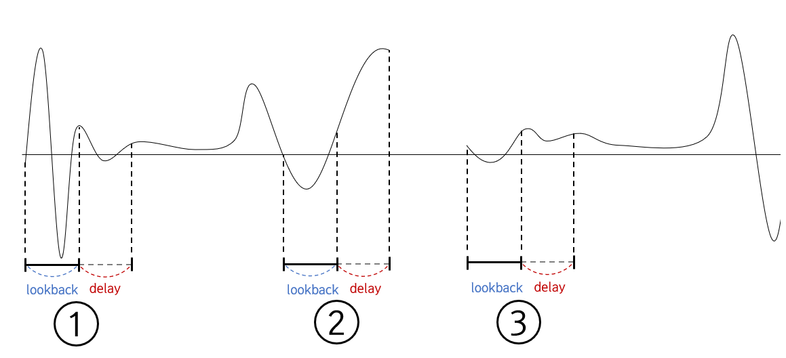

# Keras_TimeSeries

시계열 데이터의 예측을 위해 LSTM이나 GRU 같은 RNN 모델을 사용한다.
여기서 시계열 데이터란 특정한 시간 t에서 측정된 데이터들을 말한다. 다시말하면 규칙적인 시간 간격을 통해 측정되어진 데이터이다.
실제 데이터를 다루다보면 결측값이 존재하기도 하며 데이터 자체가 불규칙한 특성을 가지고 있을 수 있다.

데이터 자체가 불규칙한 특성을 가지는 예는 자동차의 배터리 전압값이 있다. 이 값은 차량이 운행중일 때만 값을 가지며 운행중이 아닐 때는 값을 가지지 않는다.
자동차의 여러 센서값들은 ECU를 거쳐 OBD장치를 통해 외부에서 데이터를 확인할 수 있다. 이 과정에서 짧은 시간동안 데이터의 결측값이 나오기도 한다. LTE 통신을 통해 데이터베이스로 저장할 때 또한 손실이 일어날 수 있다. 이와 같은 불규칙한 시계열 데이터는 다양하게 존재한다.

따라서 이 Repo에서는 RNN모델을 통해 불규칙한 시계열 데이터를 예측할 때, 알맞은 데이터셋을 생성하는 코드를 첨부한다.

---

다음은 LSTM 모델의 학습에서 lookback과 delay를 이용한 학습을 그림으로 나타낸 것이다.

lookback이란 입력으로 사용하기 위해 거슬러 올라갈 타임스텝이다.
delay란 타깃으로 사용할 미래의 타임스텝으로, lookback만큼의 입력을 통해 delay 이후 시점을 예측한다.

1번 상황부터 2번 상황이 올 떄 까지는 정의한 step에 따라 학습을 시키며 진행한다. 하지만 2번 상황의 다음으로는 진행할 수 없다. delay값이 비어있기 때문이다. 이 때 3번 상황의 가장 첫번째로 나오는 값을 사용하면 예측 정확도가 떨어진다. 따라서 학습을 멈추고 3번 상황으로 넘어가야한다.

이 때 필요한 코드를 첨부하였다.

---

> data 수 = 100
> lookback = 10
> delay = 10

위와 같은 설정값을 가지고 있을 때 결측값이 존재하지 않는다면 80번의 학습이 가능하다. 하지만 같은 100개의 데이터지만 하나의 결측값으로 인하여 50, 50으로 데이터가 나뉘었다면, 해당 번호를 건너뛰어야 하기 때문에 60(30+30)번만 학습할 수 있다. 결측값이 하나 존재할 때 학습의 기회는 크게 줄어든다.

만약 1초 단위로 존재하는 데이터라면 하나의 결측치는 모델의 예측 결과에 있어서 큰 영향을 미치지 않을 수 있다. 이러한 상황을 위해 'exception'이라는 변수를 사용하였다.
'exception'이라는 변수값을 증가시키면 자신이 원하는 시간 만큼 결측값을 무시하고 데이터셋을 형성할 수 있다.
